# Figuras Mermaid iniciales

Estas figuras son borradores editoriales. Pueden usarse en Markdown, exportarse a SVG/PNG o reemplazarse luego por piezas graficas finales.

## FIG_001 - Spotybank como caso educativo

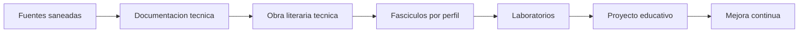

Uso editorial: capitulo 1.

## FIG_002 - Inventario tecnico desde fuentes

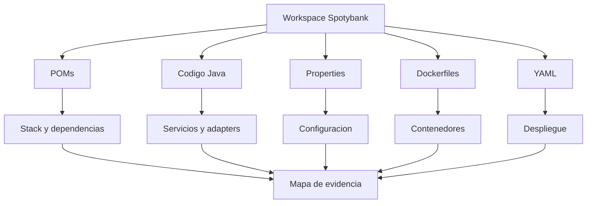

Uso editorial: capitulo 2.

## FIG_003 - Saneamiento de identidad

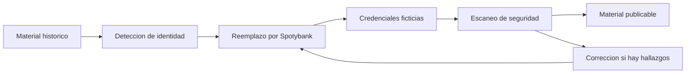

Uso editorial: capitulo 3.

## FIG_004 - Documentacion viva

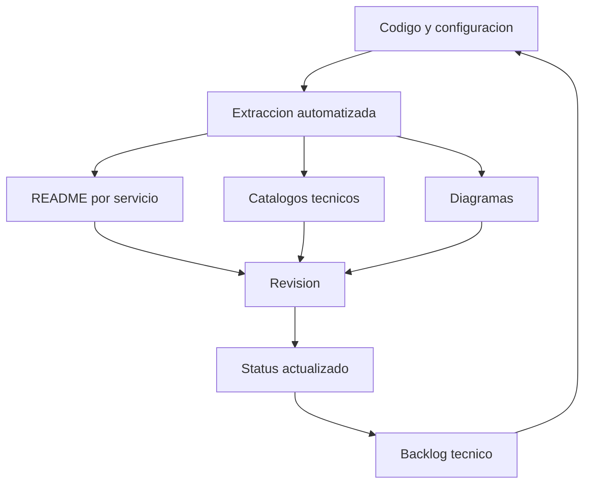

Uso editorial: capitulo 4.

## FIG_005 - Dominios y fronteras Spotybank

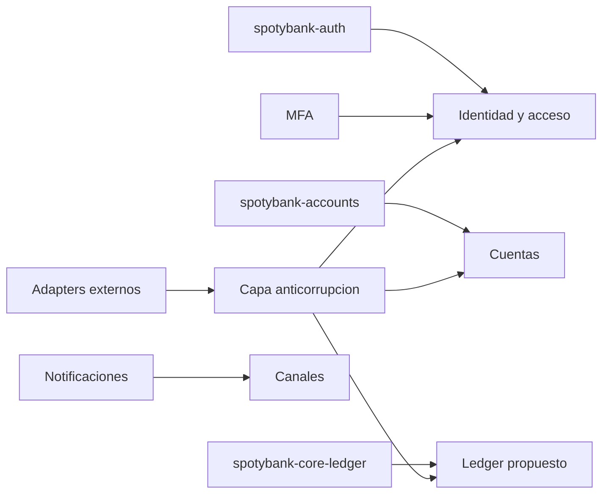

Uso editorial: capitulo 5.

## FIG_006 - Modernizacion por oleadas

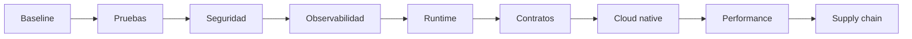

Uso editorial: capitulo 6.

## FIG_007 - DevSecOps educativo

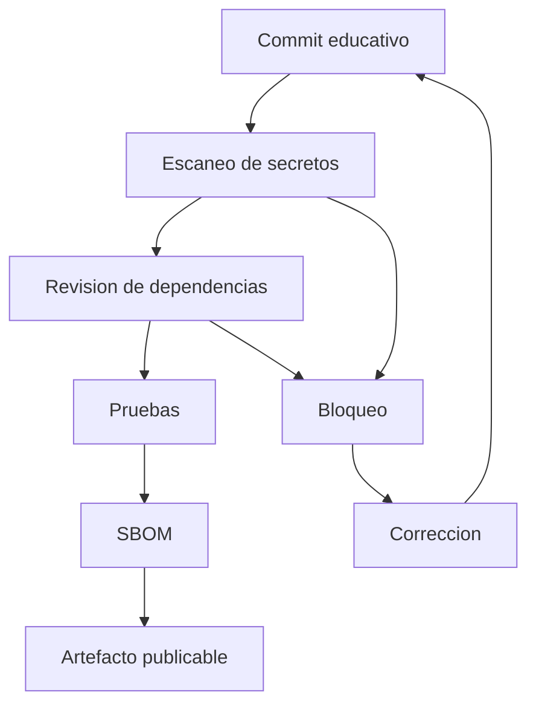

Uso editorial: capitulo 7.

## FIG_008 - Unidad minima de despliegue cloud native

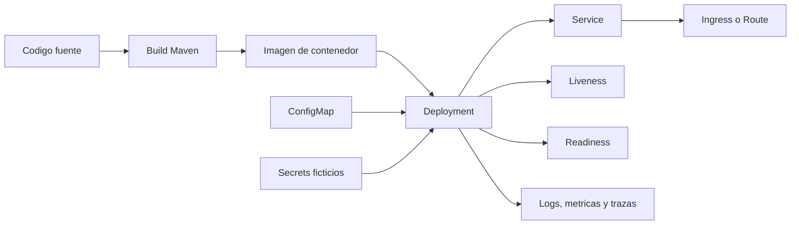

Uso editorial: capitulo 8.

## FIG_009 - Flujo de observabilidad para performance

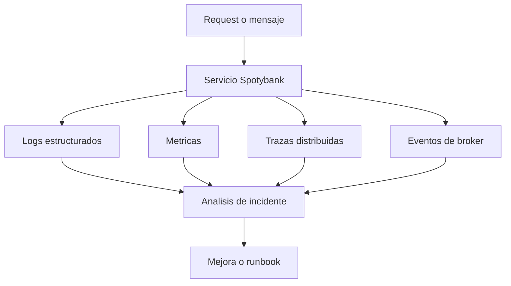

Uso editorial: capitulo 9.

## FIG_010 - Ciclo de trabajo con IA y validacion humana

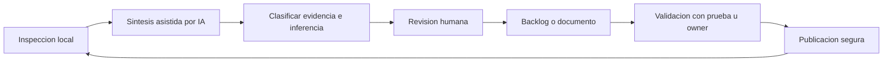

Uso editorial: capitulo 10.

## FIG_011 - Rutas formativas por perfil

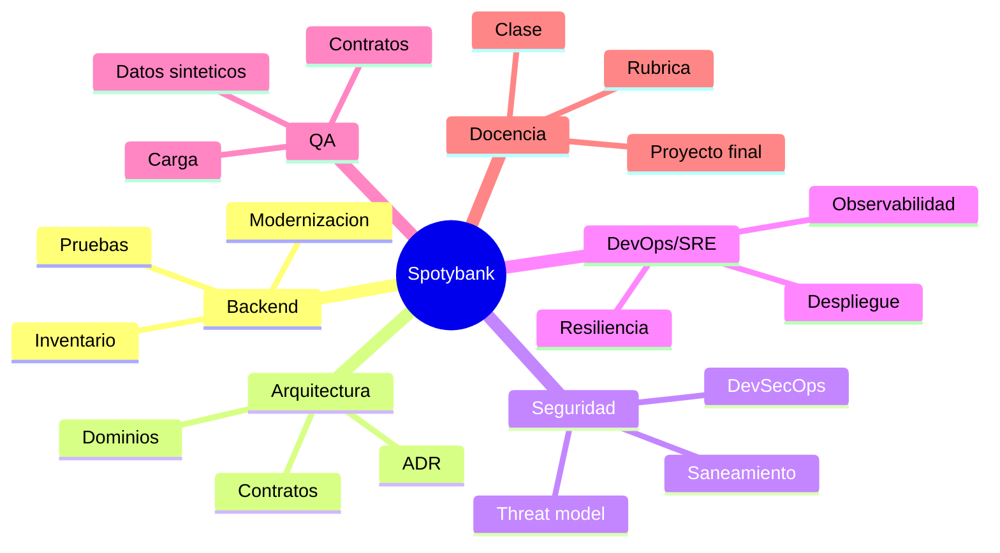

Uso editorial: capitulo 11.

## FIG_012 - Roadmap de evolucion por fases

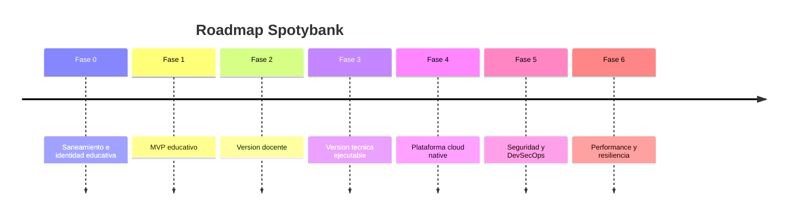

Uso editorial: capitulo 12.
