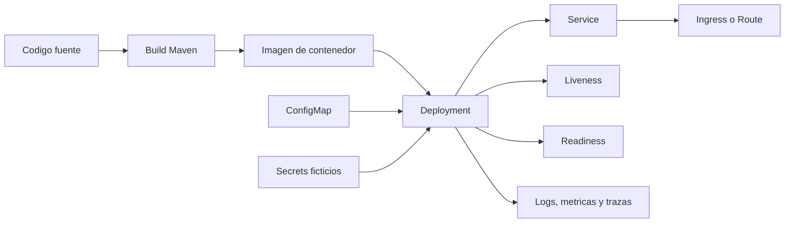
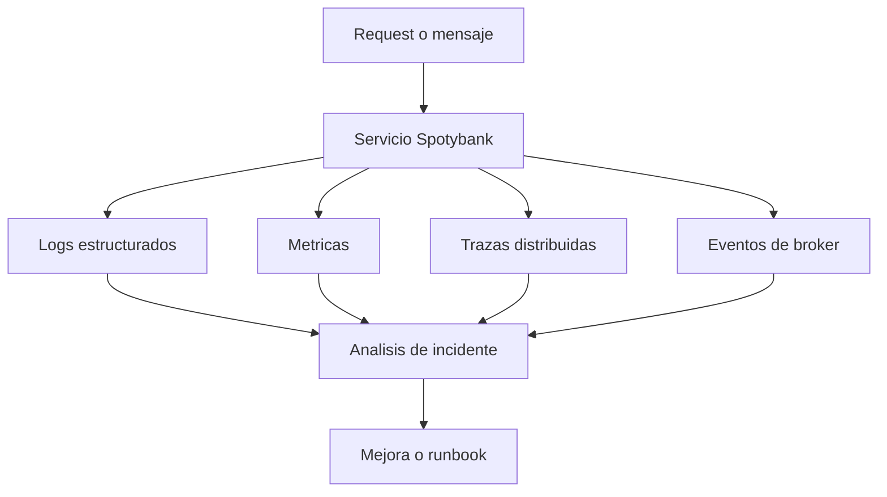
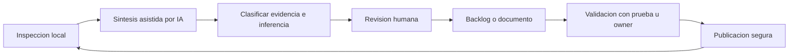
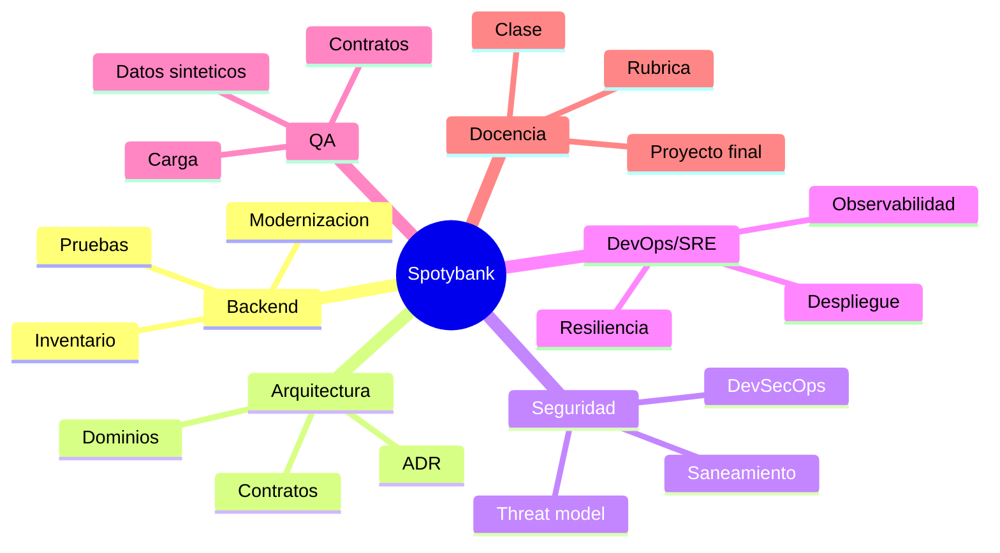
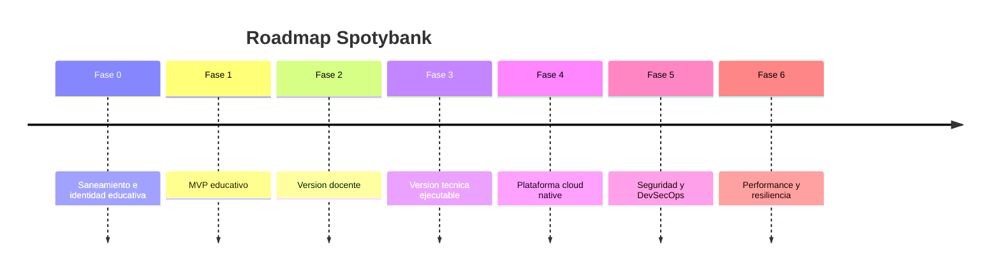

# Figuras Mermaid iniciales

Estas figuras son borradores editoriales. Pueden usarse en Markdown, exportarse a SVG/PNG o reemplazarse luego por piezas graficas finales.

## FIG_008 - Unidad minima de despliegue cloud native

Uso editorial: capitulo 8.

## FIG_009 - Flujo de observabilidad para performance

Uso editorial: capitulo 9.

## FIG_010 - Ciclo de trabajo con IA y validacion humana

Uso editorial: capitulo 10.

## FIG_011 - Rutas formativas por perfil

Uso editorial: capitulo 11.

## FIG_012 - Roadmap de evolucion por fases

Uso editorial: capitulo 12.
